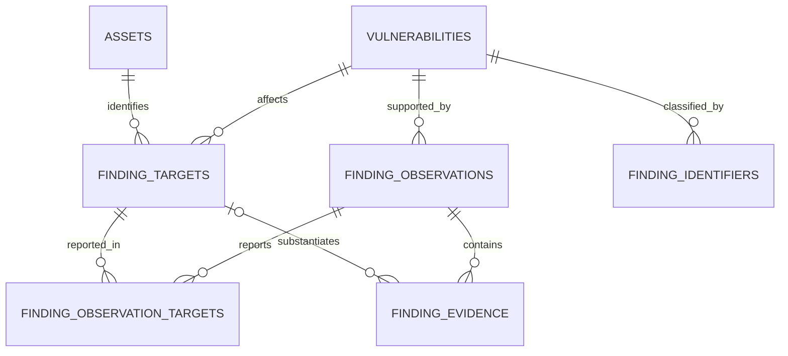

# Findings data model

## Record boundaries

The analyst-facing finding is the remediation case. Its stable platform ID is
`vulnerabilities.id`, shown as `F-000123`. A source's record ID is a different
identifier and must never replace the platform ID. The current finding row
continues to hold the analyst summary, overall status, owner, severity, risk
scores, and legacy primary asset for compatibility.



| Record | One row means | Unique identity |
| --- | --- | --- |
| `vulnerabilities` | One analyst case with one overall workflow status | Global integer PK; display as `F-` plus padded PK |
| `finding_targets` | One affected asset and endpoint, such as an IP plus port/protocol or URL | Finding plus normalized target key |
| `finding_observations` | One native record from one scanner, agent, or integration | Organization, source, source instance, source record key |
| `finding_observation_targets` | One claim that a source record covers a target | Observation plus target |
| `finding_evidence` | One typed proof item from a source record, optionally for one target | Observation, kind, target, content hash |
| `finding_identifiers` | One CVE, CWE, GHSA, or vendor identifier | Finding, kind, value |

The source key uses a stable native record ID when supplied. Otherwise it is a
hash of the source's rule, title, and original target. Connectors should supply
stable native IDs; the fallback can change if a source renames a title. Repeated
sightings update `last_seen` and `seen_count` on the same observation. Source
names and instances are part of identity, so equal IDs from Wiz and Nuclei do
not collide. A source observation may cite several targets without copying its
description into every target row.
Source severity and confidence are preserved on the observation. The finding's
severity and risk score remain the analyst-facing assessment; a new source
report does not silently replace them.

## Example: exposed databases

The pasted finding lists MySQL, PostgreSQL, MongoDB, CouchDB, Elasticsearch,
MSSQL, and Oracle endpoints inside one description, while its legacy asset is
`205.175.244.0`. In the normalized model it would retain one finding ID and
one issue summary, with **one target row per affected IP and port**. For
example, `205.175.245.227:3306/tcp` and `205.175.245.227:9300/tcp` are two
targets on the same asset. One agent observation can link to both. A banner or
request proving port 3306 can point to that exact target.

The netblock/base IP currently linked to the historical row remains a legacy
anchor. IPs mentioned in old narrative text are **not** automatically treated
as verified assets. That text needs source evidence or analyst review before
it can be converted to target rows.

## New source contract

Agent ingestion now accepts atomic `affected_targets`, `evidence_items`, and
`identifiers` alongside the existing `UnifiedFinding` fields. The arrays are
collections of records; each `asset_value` and identifier value must contain
one value. New adapters should keep `description` as a readable explanation,
not a comma-separated asset inventory or a raw source payload.

```json
{
  "id": "source-report-123",
  "type": "vulnerability",
  "source": "database-scanner",
  "target": "205.175.244.0/24",
  "title": "Database service reachable from the internet",
  "severity": "critical",
  "affected_targets": [
    {"asset_value": "205.175.245.227", "asset_type": "ip_address", "port": 3306, "protocol": "tcp", "service_name": "mysql"},
    {"asset_value": "205.175.245.227", "asset_type": "ip_address", "port": 9300, "protocol": "tcp", "service_name": "elasticsearch"}
  ],
  "evidence_items": [
    {
      "kind": "banner",
      "value": "MySQL handshake received",
      "target": {"asset_value": "205.175.245.227", "port": 3306, "protocol": "tcp"}
    }
  ],
  "identifiers": [{"kind": "cwe", "value": "CWE-306"}]
}
```

No arbitrary `raw_data` blob is copied to these normalized tables. Endpoint
URLs stored for identity omit credentials, query strings, and fragments.
Evidence remains an explicitly submitted item and may contain sensitive data;
source adapters are responsible for redacting it before submission.

## Correlation and lifecycle rules

1. Ingestion matches a prior observation by tenant, source, source instance,
   and native record ID. It keeps the same canonical finding ID on rediscovery.
2. The current agent fallback matches only within the same source and asset by
   template, CVE, or title. This avoids collapsing unrelated tools' records
   just because they share a title or CVE. Cross-source correlation requires
   exact target and issue evidence or an analyst decision; it should not rely
   on title alone.
3. A finding's existing overall status remains the workflow status. The model
   records each affected endpoint but does not yet support closing one target
   while leaving other targets open. That requires a target-level workflow and
   an explicit rule for aggregating status into the finding.
4. Every target and observation is scoped to an organization. The ingestion
   service rejects cross-organization links; the detail API filters linked
   records to the finding's organization.

## Migration and rollout

`db/migrations/add_finding_provenance.sql` creates the additive tables and
backfills only known primary assets and valid single CVE/CWE identifiers.
It does not manufacture historical source records or parse prose into asset
links. Fresh databases get the tables through SQLAlchemy `create_all`; existing
databases should run the SQL migration to backfill historical rows.

The current agent ingestion path writes the normalized records in the same
transaction as the canonical finding. The finding detail API returns targets,
identifiers, and the 50 most recent source observations with their target links
and evidence. Wiz, Censys, Nuclei, manual creation, and other direct writers
still write legacy finding fields; each should be adapted to this contract
before its provenance is treated as complete. The findings table continues to
query the canonical row, while the flyout shows the new records when present.

The old `description`, `evidence`, `references`, `tags`, and `metadata` fields
remain for existing APIs and scoring. They are compatibility projections, not
the long-term place for repeated assets, identifiers, or source records.
