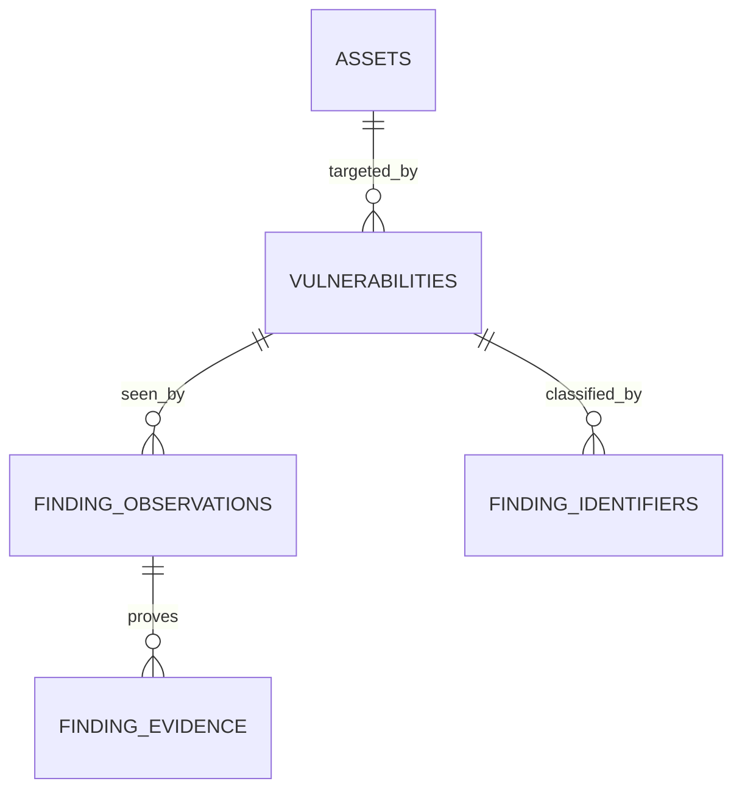

# Findings data model

## One issue on one endpoint

A finding is one issue on one asset and endpoint. Its stable platform ID is
`vulnerabilities.id`, displayed as `F-000123`. The finding row holds its title,
description, severity, status, remediation, CVE/CWE, asset ID, port, protocol,
service, URL, and verification state. The asset relationship supplies the target
value and type. The API projects those as flat `target_*` fields. There are no
child findings or nested target lists in the finding response.

The same issue on `205.175.245.227:3306/tcp` and
`205.175.245.227:9300/tcp` creates **two findings with two IDs**. They can have
different evidence, status, severity, owner, and remediation progress. The
source report may have one native ID; that ID never replaces either platform
finding ID.



| Record | One row means | Identity |
| --- | --- | --- |
| `vulnerabilities` | One issue on one asset/endpoint | Global integer PK and readable `F-` ID |
| `finding_observations` | One source record for one endpoint finding | Organization, source, instance, native record plus endpoint key |
| `finding_evidence` | One typed proof item for that finding/source | Observation, kind, content hash |
| `finding_identifiers` | One additional CVE, CWE, GHSA, or vendor identifier | Finding, kind, value |

CVE and CWE each have a single first-class field on the finding for ordinary
filtering and display. Additional identifiers have separate rows rather than
comma-separated values. Source metadata stays in observations; only evidence
is returned as a structured collection in the analyst detail response. Each
evidence item includes its source and optional native record ID.

## Ingestion contract

Agent ingestion accepts a source report with `affected_targets`,
`evidence_items`, and `identifiers` collections. These are **input
collections**, not nested findings in storage or the analyst API. Each target
must contain one asset value and, where relevant, one port/protocol or URL.
Ingestion deduplicates repeated endpoints, then creates or updates one finding
per endpoint. A target-specific evidence item is attached only to the matching
finding. Evidence without an explicit target applies to each endpoint in the
source report.

```json
{
  "id": "source-report-123",
  "type": "vulnerability",
  "source": "database-scanner",
  "target": "205.175.244.0/24",
  "title": "Database service reachable from the internet",
  "severity": "critical",
  "affected_targets": [
    {"asset_value": "205.175.245.227", "port": 3306, "protocol": "tcp", "service_name": "mysql"},
    {"asset_value": "205.175.245.227", "port": 9300, "protocol": "tcp", "service_name": "elasticsearch"}
  ],
  "evidence_items": [
    {
      "kind": "banner",
      "value": "MySQL handshake received",
      "target": {"asset_value": "205.175.245.227", "port": 3306, "protocol": "tcp"}
    }
  ]
}
```

This produces two result entries and two finding IDs. The banner appears only
on the MySQL finding. Rediscovery with the same source ID and endpoint keeps
the same finding ID and advances the observation's `last_seen` and
`seen_count`. Source names and instances are part of the key, so equal IDs
from two tools do not collide. A fallback key uses the rule/title and endpoint
when a source has no native ID; connectors should supply stable native IDs.

The detail response presents flat target fields such as `target_value`,
`target_port`, and `target_service_name`, plus a flat `evidence_items`
collection. It does not expose an observation tree or target ID joins.
Endpoint URLs are stored without credentials, query strings, or fragments.
Adapters must redact sensitive proof before submitting evidence.

## Migration and rollout

`db/migrations/add_finding_provenance.sql` adds the endpoint columns and
provenance tables. It backfills only valid singular CVE/CWE identifiers.
Historical narrative text cannot safely establish which IP:port pairs are
affected, so existing records keep their linked asset and empty endpoint
columns until a source or analyst supplies endpoint facts. The flyout labels
multi-IP legacy prose as text that needs review.

The agent ingestion path writes the new model transactionally. Wiz, Censys,
Nuclei, manual creation, and other direct writers still write legacy fields;
those adapters need separate updates before their source provenance is
complete. Existing `description`, `evidence`, `references`, `tags`, and
`metadata` remain as compatibility fields. New adapters should keep
`description` as a readable issue explanation and submit proof separately.
