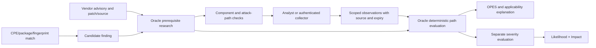

# Asset-specific vulnerability applicability

## Purpose

Explain whether a documented vulnerability path can work on a particular
deployment, and identify the evidence needed to decide. Preserve the scoring
sheet's 1–4 factor ratings. Oracle provides vulnerability research, contextual
exploitability and OPES; the severity evaluator consumes its evidence and
calculates Likelihood × Impact independently.

## Data flow



### Research contract

For each CVE, identify the affected subsystem and deployment mode, entry point,
attacker starting position and resulting capability. Every documented path
must have verifiable prerequisites and concrete collection instructions.
AND all prerequisites within a path; OR alternative paths. Transitions can
specify `path_ids`; an empty list means they constrain every path.

A CPE/version match establishes a candidate. It does not establish optional
component activation. A partial fingerprint missing the product cannot prove
absence. KEV, public exploits and CVSS are global intelligence, not local facts.

### Evidence contract

`GET /api/v1/oracle/applicability/{finding_id}` returns the checks, current
assessment and recorded observations. The authenticated user's organization
must own the finding (superusers retain their existing access).

`PUT /api/v1/oracle/applicability/{finding_id}` accepts an analyst-authorized
batch of observations. An example body follows; timestamps must reflect the
real observation time and be current when submitted:

```json
{
  "observations": [{
    "signal_path": "components.mesop_ai_sandbox.enabled",
    "value": "false",
    "method": "deployment_config",
    "reference": "image digest / deployment revision / owner ticket",
    "note": "Checked the deployed entry point and route map; sandbox is disabled",
    "observed_at": "2026-09-27T12:00:00Z",
    "valid_for_hours": 24
  }]
}
```

Only signal paths in the finding's current Oracle checks are accepted. Source,
reference, note, observer, asset scope and observation/expiry times are saved.
The validity period is 1–168 hours; default 24. Boolean conditions require an
actual `true` or `false`; `null` withdraws an observation and makes it unknown.
Observations never transfer to another asset or CVE after a finding is relinked.
The last 200 submissions are retained in metadata history; external evidence
references should point to the authoritative inventory or audit record.

The backend supplies these facts as `signals.observed_signals` to Oracle.
These explicit observations shadow inventory guesses for the same signal.
Oracle independently checks scope, freshness and the prerequisite's predicate.
Old, future, missing, withdrawn or unsupported observations remain unknown.

Saving evidence invalidates prior local conclusions before requesting Oracle
reevaluation. An outage preserves the evidence and returns a verification
needed result. A concurrent input change prevents publishing the superseded
analysis. Expiry invalidates cached analysis; the severity worker picks up
expired assessments on its next tick and removes stale zero-risk conclusions.
The risk-details endpoint also checks expiry on read.

### Analyst experience

The finding detail includes **Verify applicability on this asset**. Each check
shows its description, collection method and current result. The analyst records
an observed value and evidence reference, then selects **Save and reevaluate**.
The resulting Oracle assessment and risk score update in the finding.
No exploit code or active probes are run by this workflow.

## CVE-2026-33057 acceptance example

The vendor identifies the optional Mesop AI sandbox's execution route, with
versions through 1.2.2 affected and 1.2.3 patched. The patch removes the AI
directory. The curated regression fixture is in
`aegis-oracle/examples/cve-2026-33057/intrinsic.json` and cites the advisory and
removal change. It does not assert that any customer asset is affected.

| Evidence | Result |
| --- | --- |
| Mesop 1.2.2 fingerprint only | Candidate; needs component/runtime evidence |
| Streamlit or uvicorn fingerprint without Mesop | Unknown; partial inventory |
| Sandbox files present, activation unknown | Needs evidence |
| Affected sandbox present, enabled and attacker-reachable | Documented path conditions met; not proof of an exploit having run |
| Current deployment evidence proves sandbox absent/disabled | Documented path blocked; scope retained |
| Evidence expires, is withdrawn, or refers to another asset | Needs evidence; no inferred safety |
| One path blocked but another verified | Conditions met for the viable path |
| One prerequisite verified and another unknown | Unverified |
| Exploit proof conflicts with a blocked condition | Analyst review required |

## Scoring and boundaries

All seven factor ratings stay on the existing scoring sheet. Confirmed blocked
documented paths can set the separate likelihood cap to zero, so risk is zero.
Unknown applicability preserves a provisional numeric score and requires triage.
An endpoint or generic validation confirmation cannot replace the required
runtime evidence. Existing explicit analyst realism overrides retain their
normal precedence; they are distinct from observed facts.

Oracle's OPES remains a priority score that includes global intelligence. Its
number and applicability state are presented together; it is not a probability
and is not forced to zero merely because one documented path is blocked.

## Rollout and next integrations

1. Land the existing worker deployment and OpenAI structured-output fixes from
   PR #36 (or equivalent resolutions) before the production pilot. This feature
   targets current `main`; it does not include that separate deployment work.
   Deploy backend, Oracle (prompt `intrinsic.v7`, OPES `opes/v3-applicability`)
   and frontend together. Run the severity worker. No database migration is
   required for this feature.
2. Refresh Oracle on candidate findings to generate the new component-specific
   checks. The Mesop fixture is a regression example; production research still
   uses advisory and source material through Oracle's normal research pipeline.
3. Pilot with application owners on the suspected AI application inventory.
   Record image/source revision, entry point, route/ingress configuration and
   runtime privileges. Do not infer Mesop from Streamlit/uvicorn alone.
4. Connect existing SBOM, image inventory, runtime and cloud configuration
   collectors to the same evidence contract. Collectors must use the exact
   asset/CVE context and preserve source references and timestamps. Vendor-specific
   adapters and credentials are not included in this change.

The initial implementation uses existing finding JSON to avoid an extra service
and migration. At larger scale, move observations/history to indexed records,
add a durable refresh queue and service-account-specific collector permissions,
and track verification coverage, evidence age and false applicability verdicts.
LLM-generated prerequisite quality still needs representative human review;
the deterministic tests verify evidence handling, not the factual accuracy of
every future generated CVE assessment.
